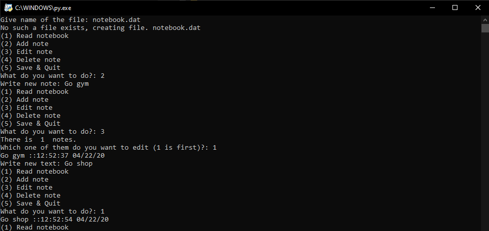

# Notebook

This is one of my projects, which shows basic usage of 'pickle' module, how to handle files in python 3 and creating simple notebook for yourself. 

Notebook:

* Is good to learn how python 3 handles files.
* Is good to learn how python 3 uses Try: and Except: commands.
* Takes user input to manipulate the notebook.
* Uses pickle module to encode the file.
* Is good example how to use TIME library to get timestamps using users own local time.

## To note!
There is no GUI made for this program, so it's only for local use in (cmd, or other shell)

## Usage

Simply download the source folder and the code is explained on the .py file.
Then you need to install some libraries with pyinstall:

## Pip install libraries
* Python 3 needs to be installed (You can download it from the official site of python.)
* Pip install pickle
* Import pickle
* Import time

## Visualization

## News

## Ghange log

## Authors
* Niclas Ekman